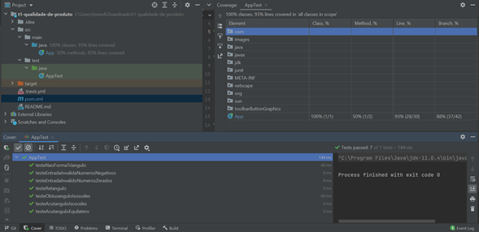
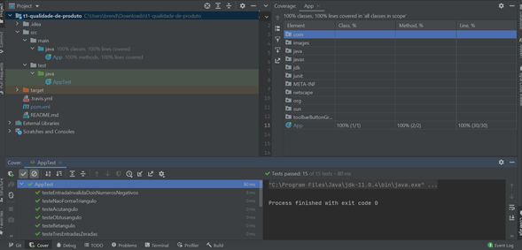
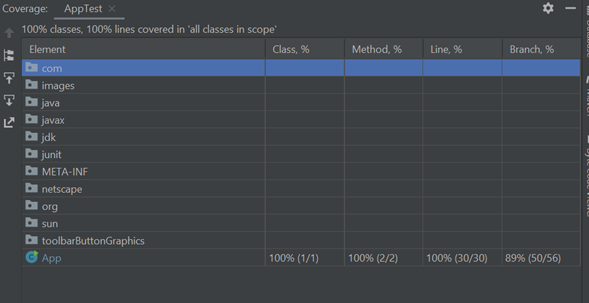
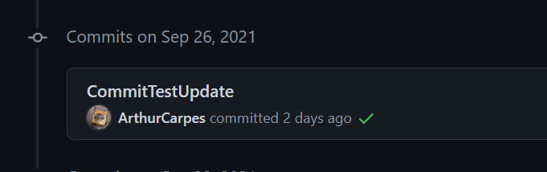

# t1-qualidade-de-produto 

# Execução dos Testes com Maven e JaCoCo utilizando o IntelliJ

Os primeiros testes geraram uma cobertura de 93% das linhas de código conforme imagem abaixo:

Após alguns ajustes nas validações e criação de novos testes, a cobertura passou a ser de 100%.

Para cobrir todas as branches seria necessário ajustar algumas validações do código, mas como não era o principal objetivo do trabalho, decidimos focar em testar os casos mais importantes e cruciais para o bom funcionamento do código.

#Comentario

O integrante do grupo Arthur teve um problema ao fazer o commit da sua branch pelo VsCode e o commit acabou sendo feito direto na Master conforme histórico de commits da classe de testes:

